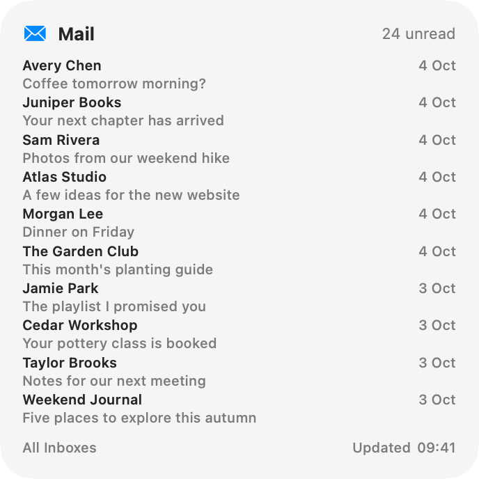
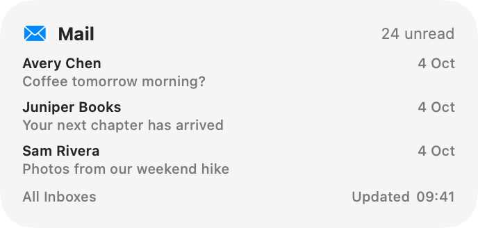
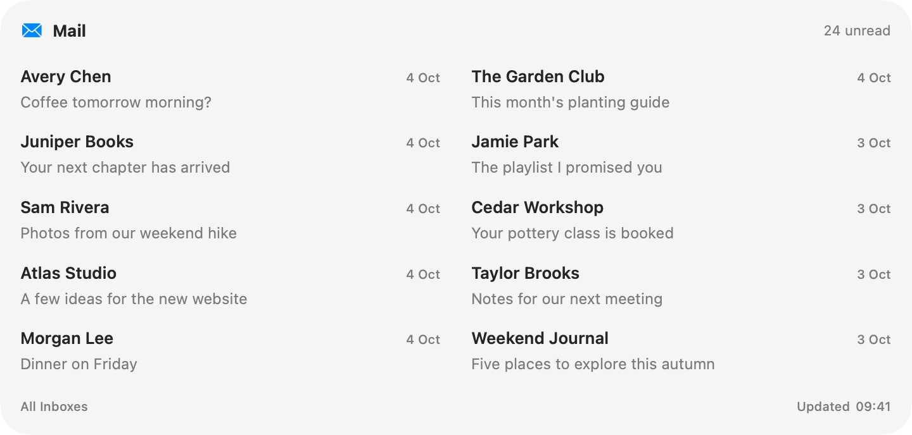

# AppleMailWidgets

Apple Email in a widget.

It can:
- Show unreads or the latest recevived.
- Multiple and different inboxes per widget
- Auto refresh in the background.

## Preview

<picture>
  <source media="(prefers-color-scheme: dark)" srcset="docs/screenshots/large-dark.png">
  
</picture>

<picture>
  <source media="(prefers-color-scheme: dark)" srcset="docs/screenshots/medium-dark.png">
  
</picture>

<picture>
  <source media="(prefers-color-scheme: dark)" srcset="docs/screenshots/extra-large-dark.png">
  
</picture>

## Requirements
Only installing from the source is possible, at the moment. Xcode and required dependencies.

## Install from source

   ```sh
   git clone https://github.com/APiercey/Apple-Mail-Widgets.git
   cd Apple-Mail-Widgets/AppleMailWidgets
   ./build-local.sh && ./install-local.sh
   ```

The app opens from `~/Applications/AppleMailWidgets.app`.

## How to use
First, open the application. You will need to click "Connect Apple Mail" to get permission to look at the inbox.

Afterwards, you are able to add a widget directly on the desktop.

If you right click on the widget, you can see further options to customize.
